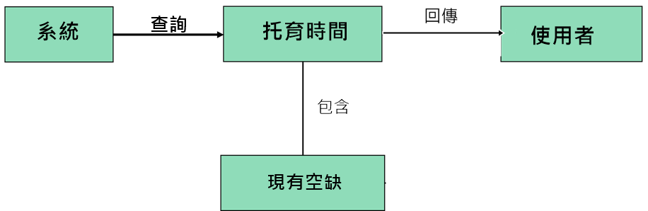
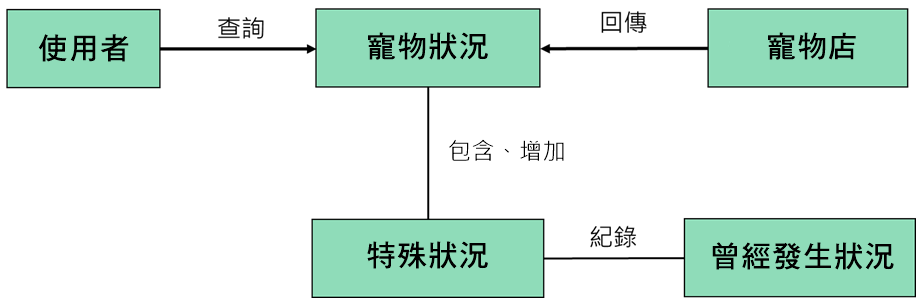
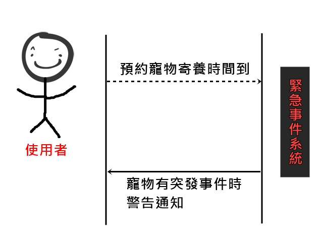

# 專題題目：寵物託管及時預約系統

## 需求：

``` 
不在寵物身邊時依舊可以知道寵物狀況，也可以不怕寵物餓肚子。
``` 

## 功能性需求：

``` 
主人有事必須出遠門，而寵物無法照顧時，可以設定APP何時給予飼料和水，也鏡頭能夠要求看寵物狀態(用拍照的)。
``` 

## 非功能需求：

``` 
操作性：APP遠端控制

效能：系統可以即時更新寵物動態，且發訊息通知使用者

安全：管理者能夠看到全部資料，一般使用者只能看自己的寵物相關資訊
``` 

## 使用案例圖：


## 由上而下使用案例的重要性：

```
1.因為有事，所以必須外出
2.打開寵物託管及時預約系統
3.立即預約
4.設定寵物用膳時間
5.預約成功，將寵物送到寵物店
6.可以要求提供寵物現狀的照片
```

## 三個使用案例：

```
1.必須外出時
2.打開寵物託管及時預約系統
3.選擇要預約的寵物店，立即預約
   3.1設定寵物用膳時間
5.預約成功，將寵物送到寵物店
6.可以要求提供寵物現狀的照片
```
```
1.必須外出時
2.打開寵物託管及時預約系統
3.選擇要預約的寵物店，立即預約
4.發現現在無法預約
   4.1 先按稍後預約(排隊)
   4.2 有人取消預約，系統立即預約
   4.3 設定寵物用膳時間
5.預約成功，將寵物送到寵物店
6.可以要求提供寵物現狀的照片
```

```
1.確定有一段時間需外出時
2.打開寵物託管及時預約系統
3.選擇要預約的寵物店，提前預約
   3.1 設定預約時間
   3.2 設定寵物用膳時間
5.預約成功，時間到時將寵物送到寵物店
```

## user story：

```
身為一個使用者，我希望寵物也能在我不在的時候，也能定時進食，這樣我才能放心出遠門又不用擔心寵物餓肚子或是發生異狀。
```

## 初步類別圖：

#### 1.系統：

#### 2.使用者預約：

#### 3.使用者查詢：


## 系統循序圖：

#### 1.突發事件警告通知：

