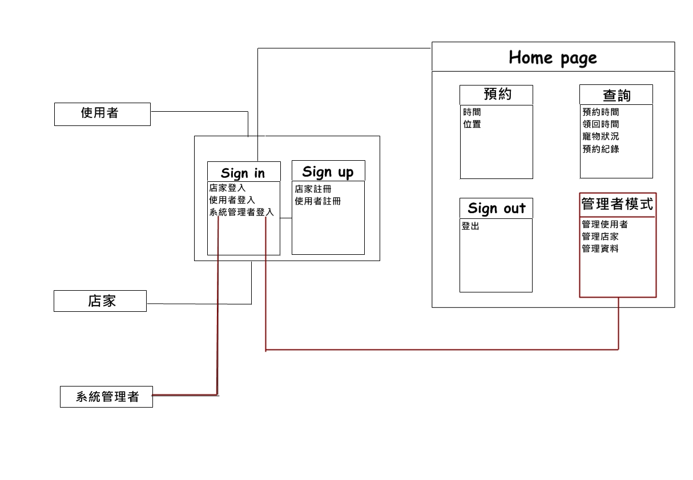

# 專題題目：寵物託管及時預約系統

## 需求：

``` 
不在寵物身邊時依舊可以知道寵物狀況，也可以不怕寵物餓肚子，有狀況時也有人可以先照顧。
``` 

## 功能性需求：

``` 
主人有事必須出遠門，而寵物無法照顧時，可以設定APP何時給予飼料和水，也能夠要求看寵物狀態(用拍照的)。
``` 

## 非功能需求：

``` 
操作性：APP控制

效能：系統可以即時回傳寵物動態，且發通知使用者

安全：管理者能夠看到全部資料，一般使用者只能看自己的寵物相關資訊
``` 

## 使用案例圖：


## 由上而下使用案例的重要性：

```
1.使用者查看寵物狀況
2.設定寵物用膳時間
3.管理者處理使用者資料及預約作業處理
4.即時更新資料
5.成功修改時間
6.照著資料定時給予食物、水
```

## 三個使用案例：

```
1.必須外出時
2.打開寵物託管及時預約系統
3.選擇要預約的寵物店，立即預約
   3.1設定寵物用膳時間
5.預約成功，將寵物送到寵物店
6.可以要求提供寵物現狀的照片
```
```
1.必須外出時
2.打開寵物託管及時預約系統
3.選擇要預約的寵物店，立即預約
4.發現現在無法預約
   4.1 先按稍後預約(排隊)
   4.2 有人取消預約，系統立即預約
   4.3 設定寵物用膳時間
5.預約成功，將寵物送到寵物店
6.可以要求提供寵物現狀的照片
```

```
1.確定有一段時間需外出時
2.打開寵物託管及時預約系統
3.選擇要預約的寵物店，提前預約
   3.1 設定預約時間
   3.2 設定寵物用膳時間
5.預約成功，時間到時將寵物送到寵物店
```

## user story：

```
身為一個使用者，我希望寵物也能在我不在的時候，也能定時進食，這樣我才能放心出遠門又不用擔心寵物餓肚子或是發生異狀。
```

## 初步類別圖：

#### 1.查詢、紀錄特殊狀況：

#### 2.使用者預約：

#### 3.查詢寵物現況：


## 系統循序圖：

#### 1.查詢、紀錄特殊狀況：

#### 2.使用者預約：

#### 3.查詢寵物現況：


## 強韌圖：


## 類別圖：



## 循序圖：


